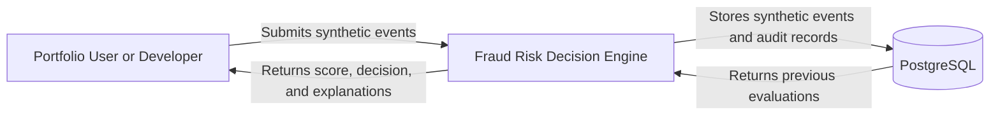

# System Context

## Purpose

The Fraud Risk Decision Engine is a standalone demonstration system for evaluating synthetic authentication and transaction events.

It receives fictional event data, applies deterministic risk rules, calculates a risk score, issues an explainable decision, and stores an auditable evaluation record.

The project does not connect to real banks, payment networks, identity providers, fraud vendors, or production systems.

## System Context Diagram

## Primary Actor

### Portfolio User or Developer

The primary actor interacts with the system through the React frontend or directly through the REST API.

The actor can:

* submit a synthetic authentication event;
* submit a synthetic transaction event;
* receive an `ALLOW`, `REVIEW`, or `DENY` decision;
* review the calculated risk score;
* inspect the rules that were triggered;
* inspect human-readable rule explanations;
* retrieve recent evaluation records.

The actor must not submit real personal, financial, employer, client, or production data.

## System Responsibilities

The Fraud Risk Decision Engine is responsible for:

* validating incoming synthetic events;
* identifying the event type;
* selecting the applicable risk rules;
* executing deterministic rule evaluations;
* calculating a score between `0` and `100`;
* converting the score into an explainable decision;
* supporting idempotent event processing;
* applying the configured failure policy;
* persisting evaluation and audit information;
* exposing evaluation results through a REST API;
* providing a minimal user interface.

## PostgreSQL Responsibility

PostgreSQL will store:

* synthetic event information;
* request hashes used for idempotency;
* evaluation results;
* decisions;
* risk scores;
* triggered-rule results;
* engine and ruleset versions;
* timestamps;
* degraded-evaluation information.

PostgreSQL is an internal infrastructure dependency and does not make risk decisions.

## Trust Boundaries

### User to Application

All incoming data must be treated as untrusted.

The application must validate:

* required fields;
* field formats;
* supported event types;
* valid score-related input ranges;
* valid timestamps;
* duplicate `eventId` usage;
* conflicting payloads.

### Application to Database

Only the application backend may directly access PostgreSQL.

The frontend must not:

* connect directly to the database;
* receive database credentials;
* construct database queries;
* modify audit records directly.

### Public Repository Boundary

All committed artifacts must be safe for public disclosure.

The repository must not contain:

* real financial data;
* private credentials;
* employer or client source code;
* proprietary fraud rules;
* internal architecture details;
* private endpoint information;
* production-derived test data.

## External Systems

The MVP has no required external business-system integrations.

The following systems are intentionally excluded:

* banking platforms;
* payment processors;
* card networks;
* identity providers;
* fraud-detection vendors;
* credit bureaus;
* message brokers;
* notification services;
* cloud-managed services.

Development tools such as GitHub and GitHub Actions support the engineering workflow but are not part of the fraud-decision domain.

## High-Level Request Flow

1. A user creates a synthetic event.
2. The frontend sends the event to the backend REST API.
3. The backend validates the request.
4. The backend checks whether the `eventId` was previously processed.
5. The domain evaluates the applicable risk rules.
6. The application calculates the final risk score.
7. The decision policy produces `ALLOW`, `REVIEW`, or `DENY`.
8. The evaluation is stored in PostgreSQL.
9. The backend returns the decision and explanations.
10. The frontend displays the evaluation result.

## Security Considerations

The initial design must account for:

* malicious or malformed requests;
* duplicate-event abuse;
* payload conflicts;
* accidental disclosure through logs;
* unauthorized modification of audit records;
* committed secrets;
* vulnerable dependencies;
* unsafe error responses;
* excessive trust in user-provided values.

These concerns will be expanded in the project threat model.

## Assumptions

The MVP assumes:

* all events are synthetic;
* the application runs in a controlled demonstration environment;
* deterministic rules are sufficient for the first release;
* a single backend instance is acceptable initially;
* PostgreSQL is available when persistence is required;
* advanced authentication and authorization are outside the first MVP.

## Limitations

This context does not represent a production banking ecosystem.

A production implementation would require additional actors and systems, including:

* authenticated users and service identities;
* authorization policies;
* encryption and key management;
* secure network boundaries;
* monitoring and alerting;
* operational incident response;
* privacy controls;
* regulatory governance;
* high availability;
* disaster recovery;
* independent security review.
